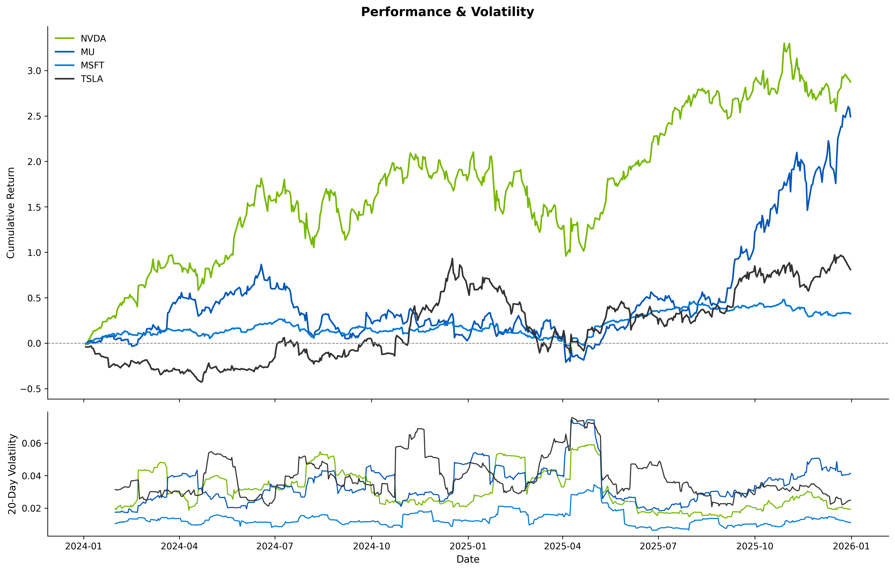

# AI Market Correlation Engine

Analyses price performance and correlation between semiconductor and tech stocks (NVDA, MU, MSFT) using Python. Produces publication-quality charts and a summary statistics table from 2 years of daily market data.

## Tech Stack
- Python 3.13
- yfinance — market data ingestion
- pandas / numpy — data cleaning and analysis
- matplotlib — static two-panel performance chart
- plotly — interactive cumulative returns chart

## Project Structure

```
ai-market-engine/
├── config.py          # Single source of truth: tickers, date range
├── fetch.py           # Download CSVs from yfinance (run once)
├── main.py            # Pipeline entry point
├── src/
│   ├── data_cleaning.py   # clean, normalize, flag outliers
│   ├── analysis.py        # returns, volatility, summary stats
│   └── visualization.py   # two-panel matplotlib chart
└── data/              # Downloaded CSVs (git-ignored)
```

## Setup

### Mac/Linux
```bash
python3 -m venv .venv
source .venv/bin/activate
pip install -r requirements.txt
```

### Windows
```bash
python -m venv .venv
.venv\Scripts\activate
pip install -r requirements.txt
```

## How to Run

**Step 1 — Download data (run once):**
```bash
python fetch.py
```

**Step 2 — Run the full pipeline:**
```bash
python main.py
```

Outputs:
- `charts/performance_overview.png` — static two-panel chart
- `charts/interactive.html` — interactive cumulative returns chart
- Summary statistics printed to terminal

## Chart



## Results (2024-01-01 to 2026-01-01)

|        | Mean Daily Return | Annualized Vol | Max Drawdown | Total Return |
|--------|:-----------------:|:--------------:|:------------:|:------------:|
| NVDA   | +0.32%            | 51.1%          | -36.9%       | +287.4%      |
| MU     | +0.32%            | 57.4%          | -57.6%       | +249.2%      |
| MSFT   | +0.07%            | 22.2%          | -23.7%       | +32.3%       |
